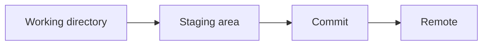

# Documentation Style Guide

This repo should look good on GitHub, MkDocs, desktop, and mobile without depending on unsupported Markdown styling.

## Core Rule

Use GitHub-compatible formatting. Do not rely on colored text, custom fonts, inline CSS, or formatting that only works in one renderer.

## Portable Formatting Tools

| Use | Good options |
| --- | --- |
| Page structure | Headings, short sections, table of contents |
| Dense reference material | Tables and quick-reference blocks |
| Long command lists | Collapsible `<details>` sections |
| Warnings or reminders | Blockquotes or MkDocs/GitHub callout-style notes |
| Workflows | Mermaid diagrams |
| Commands | Fenced code blocks with language labels |
| Visual markers | Sparse emojis or Unicode heading styles |
| Comparisons | Tables with short labels |

## Avoid

- Colored text using HTML or inline CSS.
- Arbitrary font styling.
- Image-only notes that cannot be searched.
- Huge screenshots instead of commands.
- Decorative formatting that breaks on mobile.
- Too many emojis in one section.

## Recommended Patterns

### Compact Command Block

```bash
git status
git add .
git commit -m "Describe the change"
git push
```

### Collapsible Reference

````html
<details>
<summary>Most used commands</summary>

```bash
git status
git log --oneline
```

</details>
````

When writing this pattern in a real Markdown file, keep a blank line after `<summary>` and before `</details>`.

### Comparison Table

| Command | Use when |
| --- | --- |
| `git merge` | You want to preserve branch history |
| `git rebase` | You want to replay local commits on a newer base |

### Callout-Style Note

> Note: GitHub and MkDocs render blockquotes reliably. Use them for short warnings, reminders, or interview notes.

### Mermaid Diagram



## Cheat Sheet Style

Cheat sheets can have personality, but they still need to be portable.

Good choices:

- Unicode heading styles used sparingly.
- Tables for command comparisons.
- `<details>` for long references.
- "Most Used", "Common Mistakes", "Things I Forget", and "Interview Notes" sections.
- Emojis only when they improve scanning.

Bad choices:

- Colored fonts.
- HTML-heavy layouts.
- Styling that depends on a browser extension.
- Dense decoration that makes copying commands harder.

## File Checklist

Before committing a documentation file:

- Does it render clearly on GitHub?
- Does it still read well as plain text?
- Are commands in fenced code blocks?
- Are long lists collapsed or grouped?
- Are tables short enough for mobile?
- Are internal links valid?
- Is the formatting useful, not just decorative?
