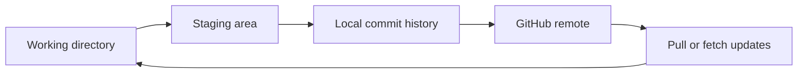

# Learning Archive


My version-controlled notebook for Git, GitHub, Markdown, terminal work, and the engineering basics I keep needing to revisit.

I started this because loose notes disappear exactly when I need them. This repo is meant to be the place I check when I forget a command, want to revise before interviews, or need to explain a workflow without guessing.

## Table of Contents

- [Workflow Map](#workflow-map)
- [Progress](#progress)
- [How I Use This](#how-i-use-this)
- [Topic Index](#topic-index)
- [Quick Commands](#quick-commands)
- [Repository Standards](#repository-standards)

## Workflow Map



## Progress

| Topic | Folder | Status | Current focus |
| --- | --- | --- | --- |
| Git | [git/](git/) | Complete | Daily workflow, branching, remotes, undoing mistakes |
| GitHub | [github/](github/) | Expanded | PRs, Actions, issues, releases, security |
| Markdown | [markdown/](markdown/) | Started | Cheatsheet and README formatting |
| Linux | [linux/](linux/) | Expanded | Filesystem, permissions, processes, SSH |
| VS Code | [vscode/](vscode/) | Expanded | Settings, shortcuts, debugging, tasks |
| Docker | [docker/](docker/) | Expanded | Images, containers, volumes, Compose |
| SQL | [sql/](sql/) | Expanded | CRUD, joins, indexes, transactions |
| Networking | [networking/](networking/) | Expanded | HTTP, DNS, TCP/IP, TLS, troubleshooting |
| System Design | [system-design/](system-design/) | Expanded | Scaling, caching, queues, APIs |
| Interview | [interview/](interview/) | Expanded | STAR, projects, coding flow, revision |

## How I Use This

- When I forget a Git command, I start with [Git Useful Commands](git/10-useful-commands.md).
- Before pushing work, I check [Git Best Practices](git/11-best-practices.md).
- When I am revising, I read one folder in order instead of jumping between random notes.
- When I learn something the hard way, I add the mistake and the fix so I do not repeat it later.

## Topic Index

### Git

The Git section is the most complete section right now. It covers setup, staging, commits, branches, merge vs rebase, remotes, undo commands, `.gitignore`, command references, and best practices.

Start here: [git/README.md](git/README.md)

### GitHub

The GitHub section tracks hosted workflows: repositories, profiles, pull requests, GitHub Pages, issues, projects, Actions, security, releases, packages, and contribution flow.

Start here: [github/README.md](github/README.md)

### Markdown

The Markdown section is for writing clean notes and READMEs that render well on GitHub.

Start here: [markdown/README.md](markdown/README.md)

### Engineering Topics

Linux, VS Code, Docker, SQL, Networking, System Design, and Interview sections now contain focused notes with commands, tables, common mistakes, and interview prompts.

- [Linux](linux/README.md)
- [VS Code](vscode/README.md)
- [Docker](docker/README.md)
- [SQL](sql/README.md)
- [Networking](networking/README.md)
- [System Design](system-design/README.md)
- [Interview](interview/README.md)

## Quick Commands

<details>
<summary>Git commands I check most often</summary>

```bash
git status
git add .
git commit -m "Describe the change"
git pull --rebase
git push
git switch -c docs/topic-name
git log --oneline --graph --decorate --all
git diff --staged
```

</details>

## Repository Standards

- Keep notes practical and searchable.
- Use one file per focused topic.
- Put commands near the context where they are useful.
- Add common mistakes, not just ideal paths.
- Use GitHub-compatible formatting: tables, blockquotes, `<details>`, code blocks, Mermaid, and sparse visual markers.
- Avoid colored text, custom fonts, and Markdown styling that breaks outside one renderer.
- Use meaningful commits such as `Document branching workflow`.
- Avoid vague commits such as `update`, `changes`, or `final`.
