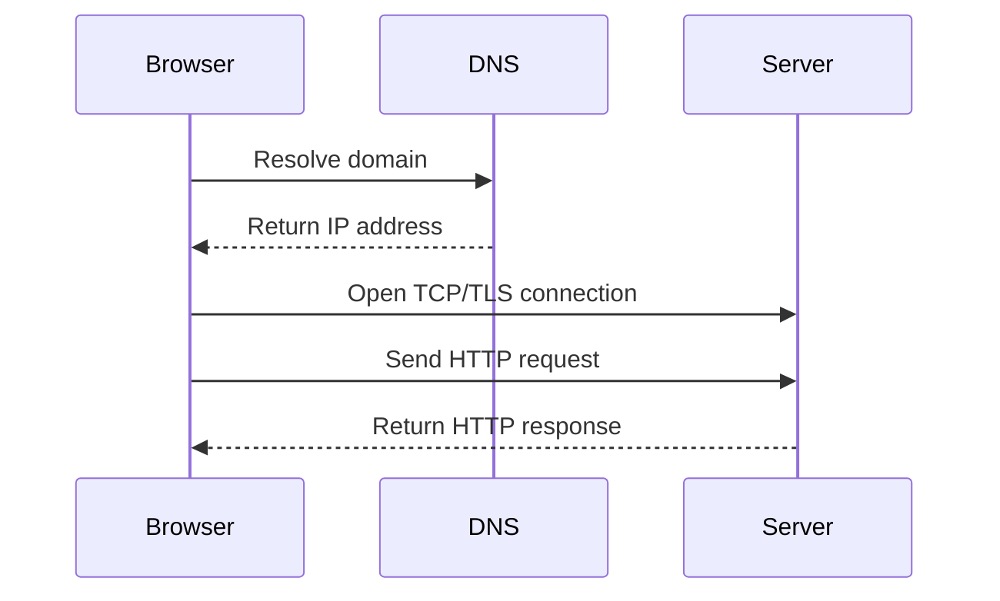

# Web Protocols

## Context

Most app debugging touches HTTP, DNS, and TLS. I keep these notes short so I can quickly explain what happens when a browser opens a URL.

## Request Flow

## HTTP

| Method | Common use |
| --- | --- |
| `GET` | Read |
| `POST` | Create or submit |
| `PUT` | Replace |
| `PATCH` | Partial update |
| `DELETE` | Delete |

Status codes:

| Code | Meaning |
| --- | --- |
| `200` | OK |
| `201` | Created |
| `301/302` | Redirect |
| `400` | Bad request |
| `401` | Unauthenticated |
| `403` | Forbidden |
| `404` | Not found |
| `500` | Server error |

## DNS, DHCP, ARP, ICMP

| Protocol | Use |
| --- | --- |
| DNS | Domain to IP |
| DHCP | Assign IP configuration |
| ARP | IP to MAC address on local network |
| ICMP | Network messages, used by `ping` |

## HTTPS and TLS

HTTPS is HTTP over TLS. TLS provides encryption, integrity, and server identity verification through certificates.

## Common Mistakes

- Treating `401` and `403` as the same problem.
- Debugging server code when DNS points to the wrong host.
- Forgetting HTTPS certificate expiration.
- Assuming `ping` success means HTTP is working.

## Quick Reference

| Need | Command |
| --- | --- |
| Headers | `curl -I https://example.com` |
| Verbose TLS/HTTP | `curl -v https://example.com` |
| DNS lookup | `dig example.com` |
| Ping | `ping example.com` |
